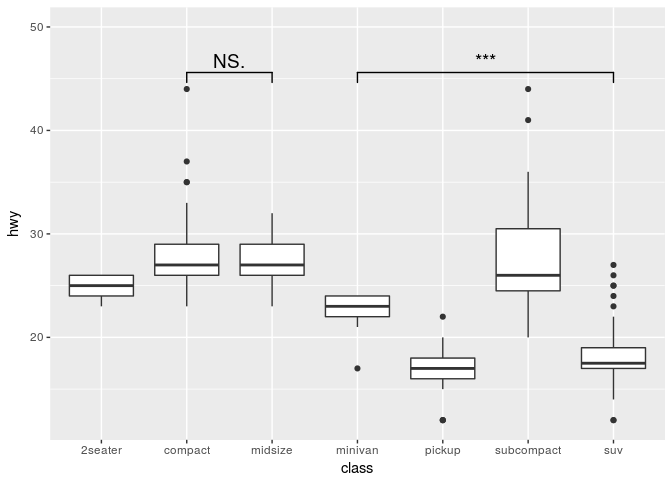
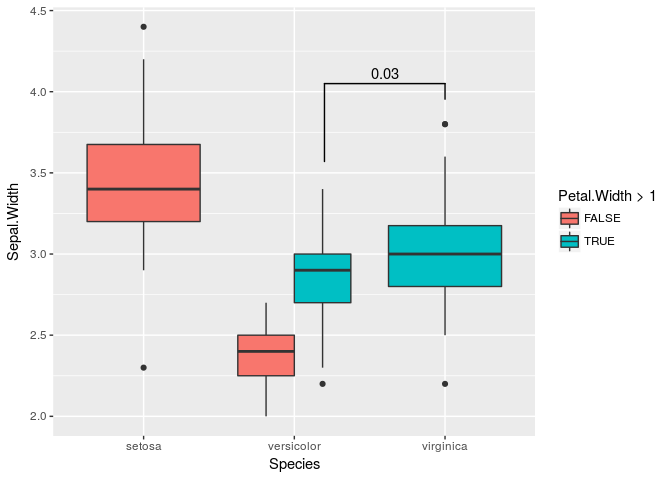

ggsignif
================

[](https://cran.r-project.org/package=ggsignif) [](https://cran.r-project.org/package=ggsignif)

Easily add significance bars to your ggplots

<!-- README.md is generated from README.Rmd. Please edit that file -->
Description
-----------

This package provides an easy way to indicate if two groups are significantly different. Commonly this is shown with a by a bar on top connecting the groups of interest which itself is annoted with the level of significance (NS, *, **, ***). The package provides a single layer (geom\_signif) that takes the groups for comparison and the test (t.test, wilcox etc.) and adds the annotation to the plot.

Example
-------

Install package

``` r
install.packages("ggsignif")

# Or for the latest development version
devtools::install_github("const-ae/ggsignif")
```

Plot significance

``` r
library(ggplot2)
library(ggsignif)
ggplot(mpg, aes(class, hwy)) +
   geom_boxplot() +
   geom_signif(comparisons = list(c("compact", "midsize"), c("minivan", "suv")),
               map_signif_level = TRUE, textsize=5) +
  ylim(NA, 50)
```



Advanced Example

``` r
# Calculate annotation
anno <- t.test(iris[iris$Petal.Width > 1 & iris$Species == "versicolor", "Sepal.Width"], 
               iris[iris$Species == "virginica", "Sepal.Width"])$p.value

# Make plot with custom x and y position of the bracket
ggplot(iris, aes(x=Species, y=Sepal.Width, fill=Petal.Width > 1)) +
  geom_boxplot(position="dodge") +
  geom_signif(annotation=formatC(anno, digits=1),
              y_position=4.05, xmin=2.2, xmax=3, 
              tip_length = c(0.2, 0.04))
```



For further details go the [CRAN page](https://CRAN.R-project.org/package=ggsignif) and check the examples in the [vignette](https://CRAN.R-project.org/package=ggsignif/vignettes/intro.html).
