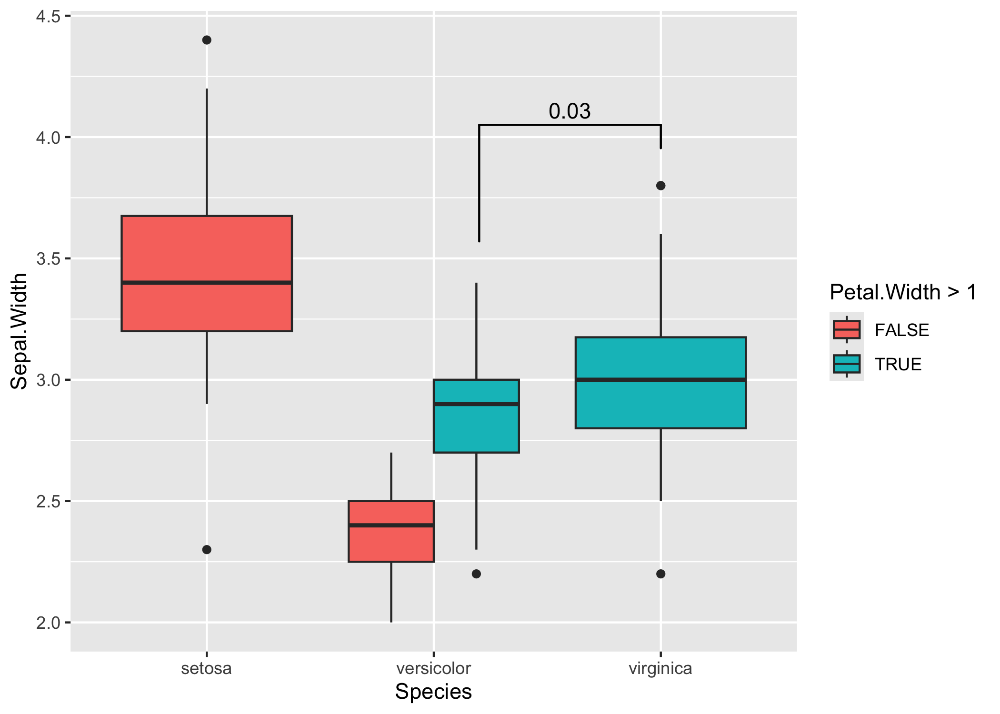

# ggsignif: Significance Brackets for ‘ggplot2’ <a href='https://github.com/const-ae/ggsignif'></a>

[](https://cran.r-project.org/package=ggsignif)
[](https://github.com/const-ae/ggsignif)
[](https://cran.r-project.org/package=ggsignif)
[](https://codecov.io/gh/const-ae/ggsignif?branch=master)
[](https://lifecycle.r-lib.org/articles/stages.html)

<!-- README.md is generated from README.Rmd. Please edit that file -->

## Introduction

This package provides an easy way to indicate if two groups are
significantly different. Commonly this is shown by a bar on top
connecting the groups of interest which itself is annotated with the
level of significance (NS, \*, \*\*, \*\*\*). The package provides a
single layer (`geom_signif`) that takes the groups for comparison and
the test (t.test, wilcox etc.) and adds the annotation to the plot.

## Citation

If you wish to cite this package in a publication, you can run the
following command in your R console:

``` r
citation("ggsignif")
#> 
#> To cite 'ggsignif' in publications use:
#> 
#>   Ahlmann-Eltze, C., & Patil, I. (2021). ggsignif: R Package for
#>   Displaying Significance Brackets for 'ggplot2'. PsyArxiv.
#>   doi:10.31234/osf.io/7awm6
#> 
#> A BibTeX entry for LaTeX users is
#> 
#>   @Article{,
#>     title = {{ggsignif}: R Package for Displaying Significance Brackets for {'ggplot2'}},
#>     author = {Ahlmann-Eltze Constantin and Indrajeet Patil},
#>     year = {2021},
#>     journal = {PsyArxiv},
#>     url = {https://psyarxiv.com/7awm6},
#>     doi = {10.31234/osf.io/7awm6},
#>   }
```

## Example

You can first install this package from `CRAN`:

``` r
install.packages("ggsignif")
```

Or get the latest development version:

``` r
install.packages("remotes")
remotes::install_github("const-ae/ggsignif")
```

Plot significance

``` r
library(ggplot2)
library(ggsignif)

p1 <- ggplot(mpg, aes(class, hwy)) +
  geom_boxplot() +
  geom_signif(
    comparisons = list(c("compact", "midsize"), c("minivan", "suv")),
    map_signif_level = TRUE, textsize = 6
  ) +
  ylim(NA, 48)
p1
```


Control the direction (either `x` or `y`) via `orientation`

``` r
p2 <- ggplot(
  data = mpg,
  mapping = aes(
    x = hwy,
    y = class
  )
) +
  geom_boxplot(
    orientation = "y"
  ) +
  geom_signif(
    comparisons = list(
      c("compact", "midsize"),
      c("minivan", "suv")
    ),
    map_signif_level = TRUE,
    textsize = 6,
    margin_top = 0.08,
    step_increase = 0.05,
    tip_length = 0.01,
    orientation = "y"
  )
p2
```


Compatible with coord\_flip

``` r
p1 + coord_flip()
```


Setting the precise location

This is important if you use `position="dodge"`, because in that case I
cannot calculate the correct position of the bars automatically.

``` r
# Calculate annotation
anno <- t.test(
  iris[iris$Petal.Width > 1 & iris$Species == "versicolor", "Sepal.Width"],
  iris[iris$Species == "virginica", "Sepal.Width"]
)$p.value

# Make plot with custom x and y position of the bracket
ggplot(iris, aes(x = Species, y = Sepal.Width, fill = Petal.Width > 1)) +
  geom_boxplot(position = "dodge") +
  geom_signif(
    annotation = formatC(anno, digits = 1),
    y_position = 4.05, xmin = 2.2, xmax = 3,
    tip_length = c(0.2, 0.04)
  )
```



Advanced Example

Sometimes one needs to have a very fine tuned ability to set the
location of the the significance bars in combination with `facet_wrap`
or `facet_grid`. In those cases it you can set the flag `manual=TRUE`
and provide the annotations as a data.frame:

``` r
annotation_df <- data.frame(
  color = c("E", "H"),
  start = c("Good", "Fair"),
  end = c("Very Good", "Good"),
  y = c(3.6, 4.7),
  label = c("Comp. 1", "Comp. 2")
)

annotation_df
#>   color start       end   y   label
#> 1     E  Good Very Good 3.6 Comp. 1
#> 2     H  Fair      Good 4.7 Comp. 2

ggplot(diamonds, aes(x = cut, y = carat)) +
  geom_boxplot() +
  geom_signif(
    data = annotation_df,
    aes(xmin = start, xmax = end, annotations = label, y_position = y),
    textsize = 3, vjust = -0.2,
    manual = TRUE
  ) +
  facet_wrap(~color) +
  ylim(NA, 5.3)
```


You can ignore the warning about the missing aesthetics.

For further details, see:
<https://const-ae.github.io/ggsignif/articles/intro.html>

## Maintenance

This package is provided as is and we currently don’t have any plans and
the capacity to add any new features to it. If there is nonetheless a
feature which you would like to see in the package, you are always
welcome to submit pull request, which we will try to address as soon as
possible.

## Code of Conduct

Please note that the `ggsignif` project is released with a [Contributor
Code of
Conduct](https://const-ae.github.io/ggsignif/CODE_OF_CONDUCT.html). By
contributing to this project, you agree to abide by its terms.
